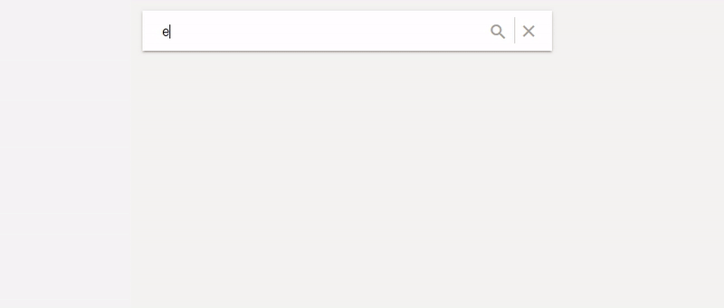

# Reactahead

[](https://travis-ci.org/UdiliaInc/create-react-library)
[]()
[]()



A lightweight yet powerful typeahead component for react.js to search through data. Key features include: 
- no npm dependencies
- highlighting matching word for the suggestions
- async loading of data with a variable threshold  
- support for multiple groups
- tab through suggestions and submit with enter
- easy to use and still flexible

Check out a Demo here: https://j-o-d-o.github.io/reactahead

## Install
Install with npm: 
```
>> npm install reactahead
```
Then include in your react app
```javscript
import Reactahead from reactahead;
```

If you want to use the code as base for your own typeahead component, feel free to copy the code from /src/lib/component/Reactahead.js & Reactahead.scss into your own react app. Happy coding :)

## Dependencies
There are no module dependencies. But for the search and cancel icon, the google material icons (https://material.io/icons/) must be included like this to the index.html:
```html
<html>
  <head>
    <link href="https://fonts.googleapis.com/icon?family=Material+Icons" rel="stylesheet">
  ...
```

## Examples
### Basic
```javascript
<Reactahead
    suggestions={["Berlin", "Paris", "London", "New York"]}
></Reactahead>
```
### Groups
```javascript
<Reactahead
    suggestions={{
        "City": ["Berlin", "Paris", "London", "New York"],
        "Country": ["USA", "England", "Germany", "Paris", "Spain"]
    }}
></Reactahead>
```
### Passing Objects
`value` will be used to search against the users input and will show in the suggestions
```javascript
<Reactahead
    suggestions={[
        { value: "Berlin (Germany)", original: { name: "Berlin", population: 3470000 } },
        { value: "New York (USA)", original: { name: "New York", population: 8538000 } },
        { value: "Rome (Italy)", original: { name: "Rom", population: 2868000 } },
        { value: "Regensburg (Germany)", original: { name: "Regensburg", population: 142292 } }
    ]}
></Reactahead>
```

### Async
Often the data is fetched from an API in a totally different structure. The developer must bring the data in the desired structure. Here is an example:


```javascript
// Passing as array
class App extends React.Component {

    onSubmit(originalObj, info){
    }

    asyncRequest(searchValue) {
        // 'searchValue' contains the user input in the search box
        return API.getSuggestions(searchValue).then((res) => {
            let returnValue = [];
            for (var i = 0; i < res.length; i++) {
                returnValue.push(res[i].name.en);
            }
            return returnValue;
        });
    }

    render() {
        return (
            <Reactahead
                onSubmit={this.onSubmit}
                asyncLoadingFuncs={this.asyncRequest}
            ></Reactahead>
        );
    }
}

export default App
```

```javascript
// Passing as Object and as group
class App extends React.Component {

    onSubmit(originalObj, info){
    }

    asyncRequest(searchValue) {
        // 'searchValue' contains the user input in the search box
        return API.getSuggestions(searchValue).then((res) => {
            // e.g. res has this format: [{ name: { en: STRING }, population: NUMBER }, ...]
            // returnValue must have this structure: [{value: STRING, original: ANY}, ...]
            let returnValue = [];
            for (var i = 0; i < res.length; i++) {
                returnValue.push({
                    value: res[i].name.en + " (" + res[i].population ")",
                    original: res.json[i]
                });
            }
            return returnValue;
        });
    }

    render() {
        return (
            <Reactahead
                onSubmit={this.onSubmit}
                asyncLoadingFuncs={{
                    "Group Async": this.asyncRequest
                }}
            ></Reactahead>
        );
    }
}

export default App
```
## API
Method | Description
--- | ---
`clearInput()` | Clear the user input and close the suggestions

To access the api use the api prop:
```javascript
submit(org, info){
    // Close suggestions
    this.my_reactahead.clearInput()
}
render() {
    return (
        <Reactahead 
            onSubmit={this.submit} 
            api={api => this.my_reactahead = api} ...>
        </Reactahead>
    );
}
```

## Callbacks

| Property        | Description  |
| ------------- |:-------------| 
| onChange: Function     | Callback for change events. Passes through the input event for onChange. | 
| onSubmit: Function     | Callback for submit events. Submit events are fired if the user submits the input form.       |  
| onCancel: Function | Callback for the cancel event which occurs if the user presses the cancel/close button 'X'. Or clears the input via the api.      | 

#### Examples

```javascript
myChangeCb(evt){
}
render() {
    return (
         <Reactahead onChange={this.myChangeCb} ...></Reactahead>
    );
}
```

onSubmit gets triggered by these events: 
- pressing Enter while focusing the input field
- pressing Enter while focusing one of the suggestions
- clicking on one of the suggestions
- clicking on the search button. 

The values that are passed to the callback are the original object and an info object. The info object contains these values: 
```javascript
{ 
    isSuggestion: BOOLEAN,  // True when user clicked on suggestion or focused suggestion while pressing enter
    valueRaw: STRING,       // The search value the user has typed into the search field
    groupName: STRING,      // Group which the suggestion is part of (undefined if it is not a suggestion)
    suggestions: []         // contains all suggestions for the current searchValue
}
```
```javascript
mySubmitCb(original, info){
}
render() {
    return (
         <Reactahead onSubmit={this.mySubmitCb} ...></Reactahead>
    );
}
```
```javascript
myCancelCb(){
}
render() {
    return (
         <Reactahead ref="reactahead" onCancel={this.myCancelCb} ...></Reactahead>
    );
}
```

## Propertys

| Tables        | Are           |
| ------------- |:-------------| 
| threshold: int    | How long should the asyncRequest wait until it loads new data (in ms). That way the server is not being spamed after each keystroke. Default = 200 | 
| placeholder: string | Determines the placeholder for the input field. Default = "Search" |
| showGroupNames: boolean | Determines weather the suggestions groups should be shown or not. If there are no results for the group it is not shown regardless. Default = false |
| showNoResults: boolean | Flag to deterimne weather to show a "no result" suggestion if no suggestion matches the user input |
| noResultMsg: string | String that shows if showNoResults = true, Default = "No Results found" |
| sendFirstSuggestionFlag: boolean | If it is set to true and the user is presses the search button or enter while focusing the search field, the first suggestion will be sent via the submit callback. On false the 1. argument of onSubmit will be null and all the suggestions will be in info["suggestions"]. Default = true |
| maxSuggestions: int | Max amount of suggestions shown per group. Default = 20 |
| suggestions: array[any] -or- object | Data for suggestions (check out the examples for more info) |
| asyncLoadingFuncs: Function -or- object | The functions to load data e.g. from an API. (check out the examples for more infos) |
| ...rest | All other properties are passed to the outer reactahead component div e.g. id, className, style, ... |


## Bugs / Feature Requests / Contribution
Feel free to file bug reports or feature requests via the issue tracker or contribute via pull requests. 
To run the demo locally run:
```
>> npm run start
```
To build the module:
```
>> npm run build
```
To build the public github page:
```
>> npm run set-node-env
>> npm run build-demo
```

## Roadmap
- Search also the groups, so if there is a group = "continents" display all continents if user types "continent"
- Implement fuzzy search where not every character must be the same. E.g. display "Apple" even if user writes "Aple"
- Support icons infront of suggestions
- Fully customizable suggestion styles
- Flag to just always show all provided suggestions (and async suggestions). This is usefull if the developer does not want to use the reactahead search algorithm but his or her own. 

</br></br>
This npm module is built with "Create-React-Library" (https://github.com/UdiliaInc/create-react-library)


